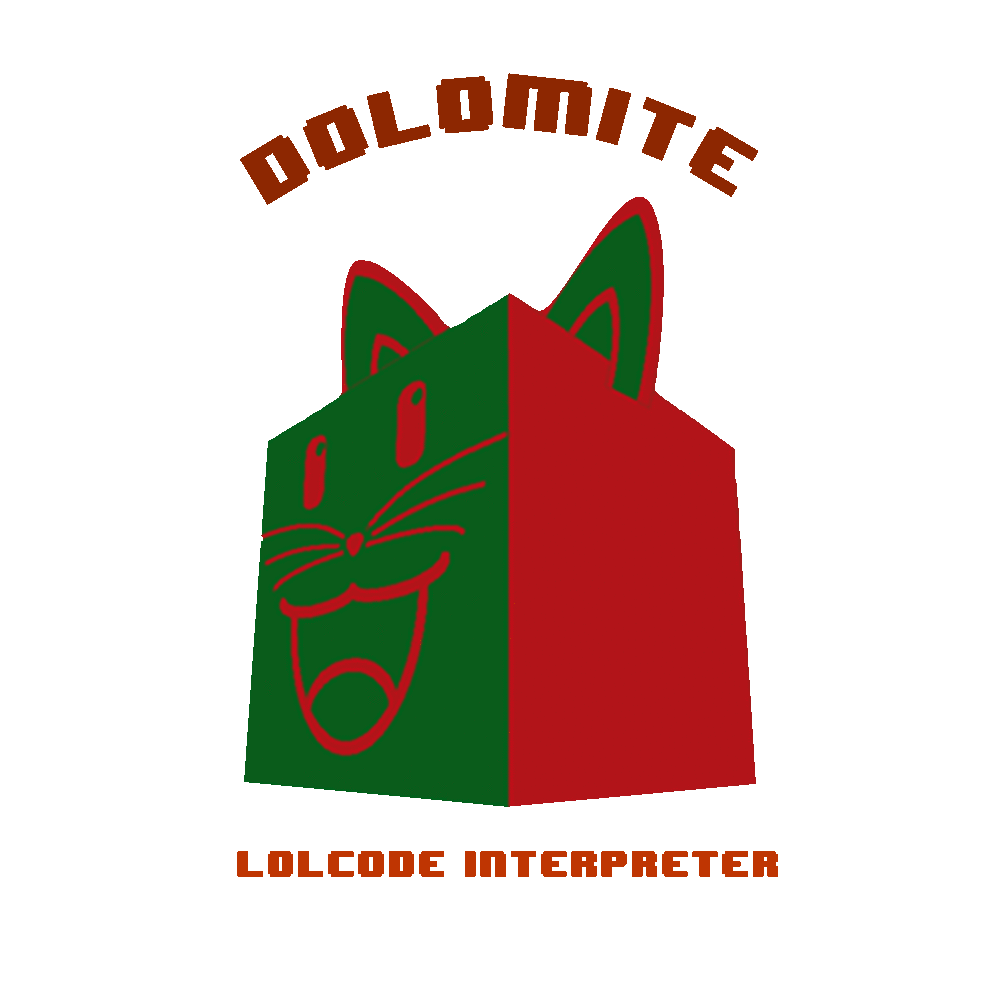

<h1 align = "center">
    
    <br/>
    DOLOMITE: LOLCODE Interpreter
    <br/>
     
</h1>


Welcome to Dolomite: LOLCODE interpreter. This was developed by the Group Dolomite in fulfillment of their CMSC 124 requirements. The members are Daniel Aguilar, Steven Crespo, and Ged Malabanan from section T-8L under Ma'am Erika Cunanan and Ma'am Bernadette Pelaez.

# Dependencies
This program requires the latest version of Python installed. It is also recommended to run the program in
Windows to avoid issues with Tkinter (which has compatibility issues with macOS).


# Building 

In order to build the analyser using the terminal, you must first clone the repository:

`git clone https://github.com/Daniel-Pete/CMSC124-Project.git`

Once you have downloaded the repository, navigate into the following directory:

<code>
cd CMSC124-Project
</code>

You are now ready to run the interpreter. If you are using **Windows**, type the command below in order to run the interpreter:

`python UI.py`

If you're using **macOS** or **Linux**, you are required to run the interpreter using the latest version of Python. Running in previous versions may result into an error. Run the interpreter using the command below:

`python3 UI.py`


# License #

```
“Commons Clause” License Condition v1.0

The Dolomite: LOLCODE Interpreter is provided to you by the MIT under the MIT License, 
as defined below, subject to the following condition.

Without limiting other conditions in the MIT License, the grant of rights under the MIT 
License will not include, and the MIT License does not grant to you, the right to Sell 
the LOLCODE Interpreter.

For purposes of the foregoing, “Sell” means practicing any or all of the rights granted to
you under the MIT License to provide to third parties, for a fee or other consideration 
(including without limitation fees for hosting or consulting/ support services related to 
the LOLCODE Interpreter), a product or service whose value derives, entirely or substantially, 
from the functionality of the LOLCODE Interpreter. Any license notice or attribution required 
by the MIT License must also include this Commons Clause License Condition notice.

```